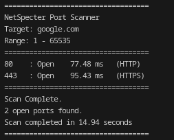
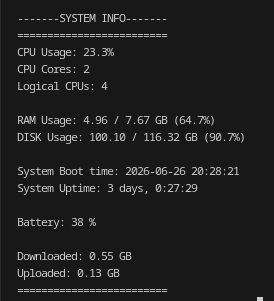
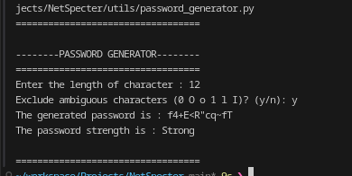
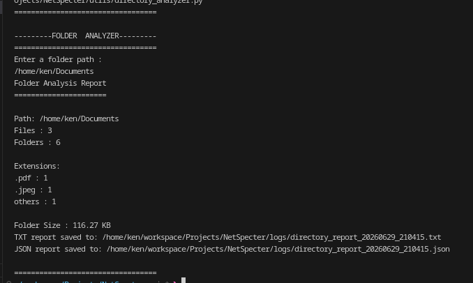
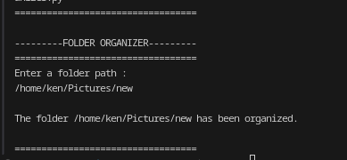

# NetSpecter
> A learning-focused cybersecurity toolkit built to explore networking, Linux, and Python through practical command-line utilities.

NetSpecter is a modular command-line toolkit written in Python that combines networking, cybersecurity, system monitoring, and file management utilities into a single application.

The project was built as part of my software engineering and cybersecurity learning journey, with a focus on writing clean, maintainable code while exploring socket programming, concurrent programming, Linux development, and command-line application design.

---

## Features

### Networking

* Multithreaded TCP Port Scanner
* Hostname to IP Resolution
* Service Detection
* Configurable Thread Pool
* Configurable Socket Timeout
* JSON Scan Reports
* Port Latency Measurement

### File Utilities

* Directory Analyzer
* Automatic File Organizer

### Security

* Cryptographically Secure Password Generator
* Optional Ambiguous Character Exclusion

### System Monitoring

* CPU Information
* Memory Usage
* Disk Usage
* Network Statistics
* System Uptime

### Command-Line Interface

* Unified CLI (`main.py`)
* Subcommand-based architecture using `argparse`
* Modular project structure

---

## Quick Start

Clone the repository:

```bash
git clone https://github.com/kankan223/NetSpecter.git
cd NetSpecter
```

Create a virtual environment:

```bash
python -m venv venv
```

Activate it:

### Linux

```bash
source venv/bin/activate
```

Install dependencies:

```bash
pip install -r requirements.txt
```

Display all available commands:

```bash
python main.py --help
```

---

## Project Structure

```text
NetSpecter/ 
├── main.py
│
├── scanner/
│   └── scanner.py
│
├── utils/
│   ├── directory_analyzer.py
│   ├── file_organizer.py
│   ├── password_generator.py
│   └── system_monitor.py
│ 
├── config/
│   └── port_scanner_config.json
│
├── logs/
│
├── screenshots/
│
├── requirements.txt
├── README.md
├── LICENSE
└── .gitignore
```

---

## Requirements

* Python 3.11+
* Linux (developed and tested on Arch Linux)

Third-party packages:

- psutil
- rich *(planned for enhanced terminal output)*

Install dependencies:

```bash
pip install -r requirements.txt
```

---

## Usage

Display all available commands:

```bash
python main.py --help
```

### Port Scanner

```bash
python main.py scan google.com
```

```bash
python main.py scan 192.168.1.1 -s 20 -e 1024
```

### Password Generator

```bash
python main.py password
```

```bash
python main.py password -l 20 -a
```

### Directory Analyzer

```bash
python main.py analyze ~/Downloads
```

### File Organizer

```bash
python main.py organize ~/Downloads
```

### System Information

```bash
python main.py system
```

## Configuration

The port scanner reads its settings from:

```text
config/port_scanner_config.json
```

Current configurable options include:

* Socket timeout
* Maximum worker threads
* Log generation

---

## Example

```text
$ python main.py scan scanme.nmap.org -e 1024

===================================
NetSpecter Port Scanner
Target: scanme.nmap.org
Range: 1 - 1024
===================================

22     Open     0.42 ms    (SSH)
80     Open     1.18 ms    (HTTP)

===================================
Scan Complete.
2 open ports found.
Scan completed in 0.54 seconds
===================================
```

---

## Output

The toolkit automatically generates structured reports where applicable.

### Port Scanner

    - JSON scan reports

### Directory Analyzer

    - JSON reports
    - TXT reports

---

## Future Roadmap

Planned features include:

* Banner Grabbing
* UDP Port Scanner
* Network Discovery
* Rich Terminal Interface
* Plugin Support
* Unit Testing
* GUI Application
* OS Fingerprinting
* Packaging for pip

---

## Technologies Used

### Languages & Libraries

* Python
* argparse
* socket
* pathlib
* ThreadPoolExecutor
* JSON
* psutil

### Concepts

* Networking
* Socket Programming
* Concurrent Programming
* Linux Development
* Cybersecurity Fundamentals
* Software Architecture
* Command-Line Applications
* Git & GitHub

---

## Screenshots

### Port Scanner



### System Information



### Password Generator



### Directory Analyzer



### Folder Organizer



---

## Current Status

NetSpecter is under active development.

The current release focuses on building a modular command-line toolkit for networking and system utilities. Future updates will introduce advanced cybersecurity features such as banner grabbing, UDP scanning, network discovery, richer terminal interfaces, automated testing, packaging support, and additional Linux utilities.

---

## License

This project is licensed under the MIT License.

See the LICENSE file for details.

---

Developed by **Ken** as part of a continuous software engineering and cybersecurity learning journey.